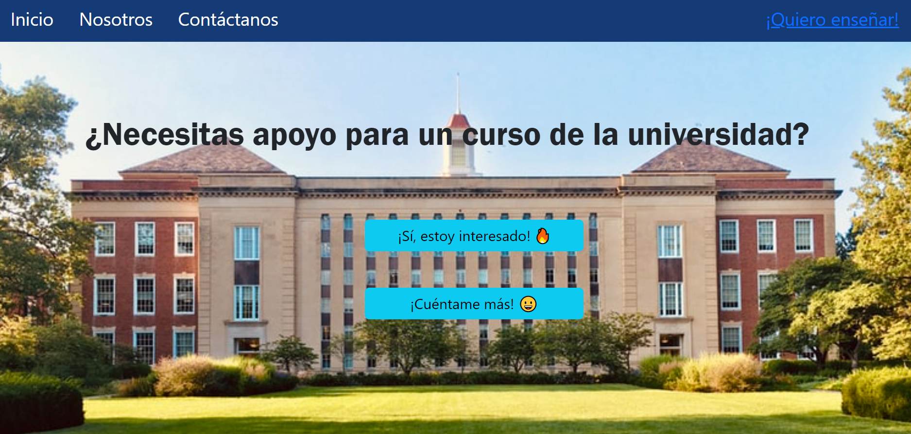
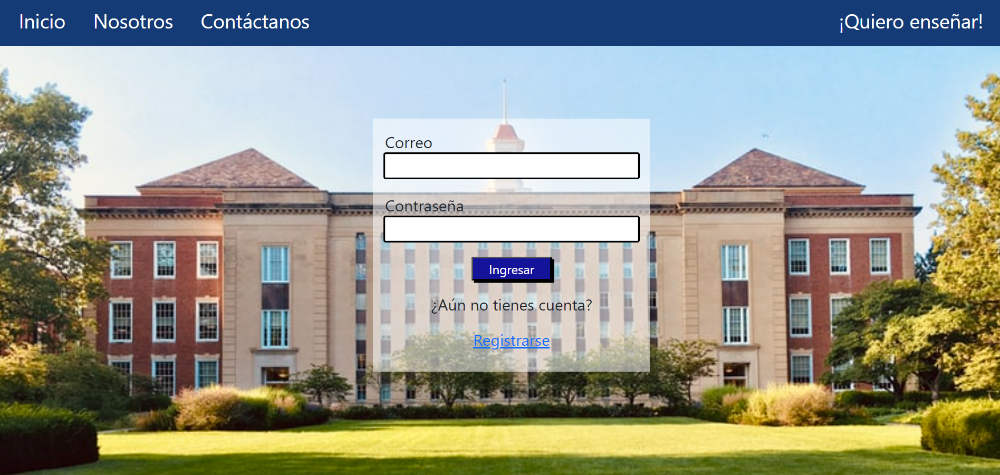
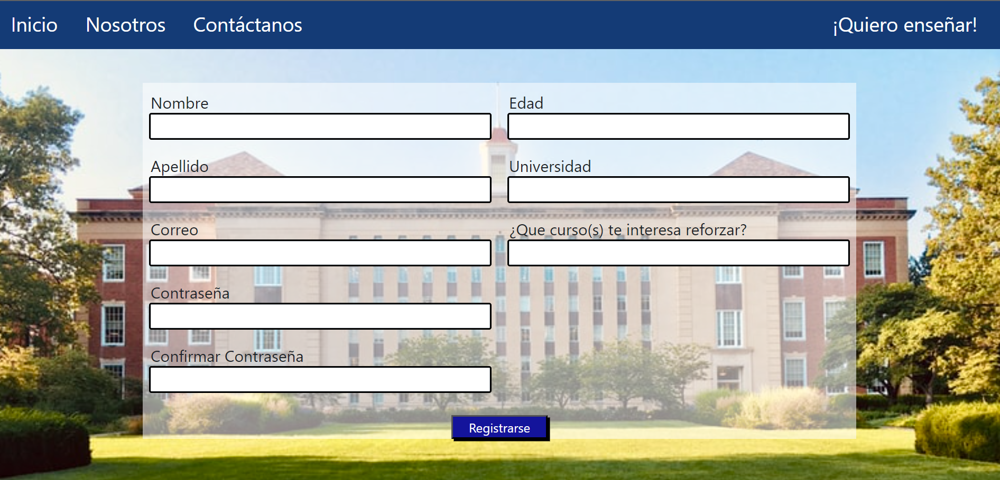
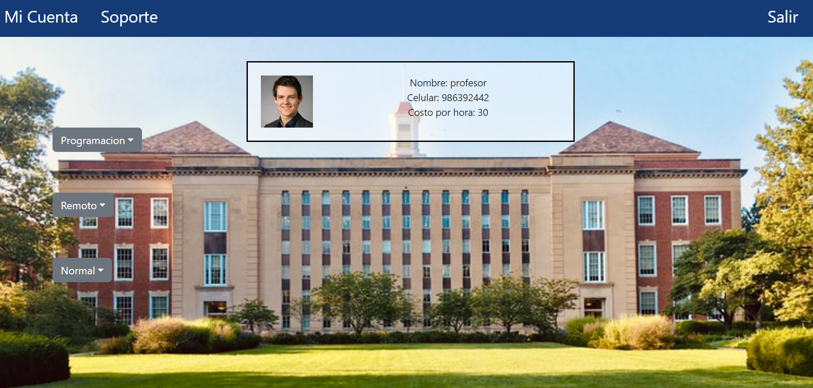
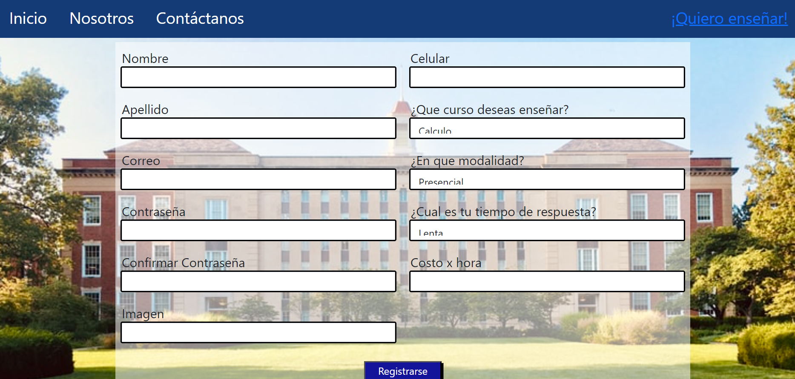

# Project

A MERN(Mongodb, Express, React and Nose) final Project for coding dojo bootmcap

## Requirements

git and npm

## Instalation

-git clone (url)

-cd/backend
-npm install
-npm start

-cd/frontend
-npm install
-npm start

## Evidences

Home

Login student

Register student

Course search

Register teacher

